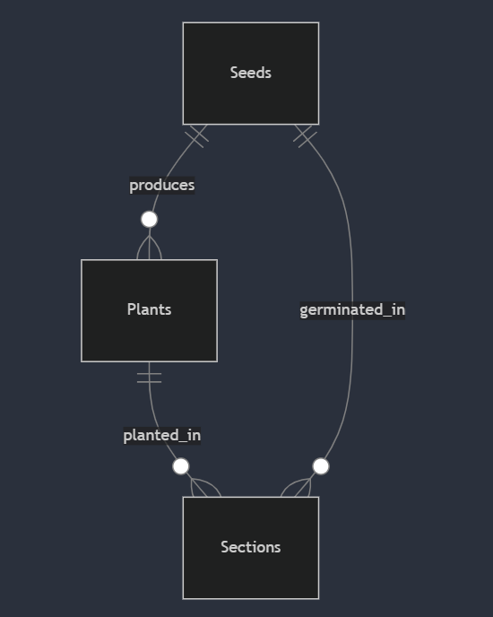

# Design Document

By Amaya Devindi

Video overview: (https://youtu.be/9aQx5DjVx28)

## Scope

This database is designed to manage my home garden, tracking seeds, plants, and garden sections.

* **Included:**
    * Detailed information about seeds (germination, planting instructions).
    * Information about plants (growth requirements, maturity).
    * Details about garden sections (sunlight, soil).
    * Records of planting and germination (dates, progress).
* **Excluded:**
    * Real-time weather data.
    * Financial records related to the garden.
    * Detailed pest and disease tracking.
    * Advanced inventory management.

## Functional Requirements

This database should allow users to:

* Record and view seed, plant, and garden section information.
* Track planting and germination progress, including automatic calculations of plant and seed age and harvest/completion dates.
* Search and filter plants and seeds.
* View combined data through views.

It will not include:

* Automated alerts.
* Complex data analysis.
* Real-time sensor integration.
* Multi-user access.

## Representation

### Entities

* **seeds:**
    * `seed_id` (INTEGER, PRIMARY KEY): Unique seed identifier.
    * `seed_name_in_english` (TEXT, NOT NULL): English seed name.
    * `seed_name_in_sinhala` (TEXT, NOT NULL): Sinhala seed name.
    * `days_to_germinate` (INTEGER, NOT NULL, CHECK > 0): Germination time.
    * `direct_sow` (TEXT, NOT NULL, DEFAULT 'no', CHECK 'yes' or 'no'): Direct sow indicator.
    * `water_soak` (TEXT, NOT NULL, DEFAULT 'no', CHECK 'yes' or 'no'): Water soak indicator.
    * `how_to_plant` (TEXT): Planting instructions.
    * `notes` (TEXT): Additional notes.
* **plants:**
    * `plant_id` (INTEGER, PRIMARY KEY): Unique plant identifier.
    * `seed_id` (INTEGER, FOREIGN KEY seeds): Seed identifier.
    * `plant_name_in_english` (TEXT, NOT NULL): English plant name.
    * `plant_name_in_sinhala` (TEXT, NOT NULL): Sinhala plant name.
    * `plant_type` (TEXT, NOT NULL, CHECK plant types): Plant type.
    * `days_to_maturity` (INTEGER, NOT NULL, CHECK > 0): Maturity time.
    * `ideal_sunlight` (TEXT, NOT NULL, CHECK sunlight levels): Sunlight requirements.
    * `ideal_water` (TEXT, NOT NULL, DEFAULT 'moderate', CHECK water levels): Water requirements.
    * `ideal_soil` (TEXT): Soil requirements.
    * `how_to_plant` (TEXT): Planting instructions.
    * `notes` (TEXT): Additional notes.
* **sections:**
    * `section_id` (INTEGER, PRIMARY KEY): Unique section identifier.
    * `section_name` (TEXT, NOT NULL): Section name.
    * `sunlight` (TEXT, NOT NULL, CHECK sunlight levels): Sunlight conditions.
    * `has_space` (TEXT, DEFAULT 'yes', CHECK 'yes' or 'no'): Space availability.
    * `soil` (TEXT): Soil conditions.
    * `notes` (TEXT): Additional notes.
* **plants_and_sections:**
    * `id` (INTEGER, PRIMARY KEY): Unique planting record identifier.
    * `plant_id` (INTEGER, FOREIGN KEY plants): Plant identifier.
    * `section_id` (INTEGER, FOREIGN KEY sections): Section identifier.
    * `planted_date` (DATE, NOT NULL): Planting date.
    * `days_old` (INTEGER, trigger calculated): Days since planting.
    * `harvest_date` (DATE, trigger calculated): Harvest date.
* **seeds_and_sections:**
    * `id` (INTEGER, PRIMARY KEY): Unique germination record identifier.
    * `seed_id` (INTEGER, FOREIGN KEY seeds): Seed identifier.
    * `section_id` (INTEGER, FOREIGN KEY sections): Section identifier.
    * `start_date` (DATE, NOT NULL): Germination start date.
    * `days_old` (INTEGER, trigger calculated): Days since germination started.
    * `complete_date` (DATE, trigger calculated): Germination completion date.

    * **Types and Constraints:**
        * INTEGER: For IDs and numerical data.
        * TEXT: For names and descriptions.
        * DATE: For dates.
        * NOT NULL: Ensures data presence.
        * PRIMARY KEY: Unique record identifier.
        * FOREIGN KEY: Establishes relationships.
        * CHECK: ensures data is in the correct format and range.
        * DEFAULT: Provides default values.

### Relationships

* One `seed` can produce many `plants`.
* One `plant` can be planted in many `sections`.
* One `section` can contain many planted `plants`.
* One `seed` can be germinated in many `sections`.
* One `section` can contain many germinating `seeds`.

## Optimizations

* **Indexes:** Created indexes on frequently searched columns (plant names, seed names, section names, plant types) to improve query speed.
* **Views:** Created views to simplify complex queries and combine data (plant-seed, plant-section, seed-section).
* **Triggers:** Implemented triggers to automatically calculate `days_old` and `harvest_date`/`complete_date`, ensuring data accuracy.

## Limitations

* Single-user design.
* Limited external data integration.
* Basic image storage.
* Simple planting tracking, no complex features like crop rotation.